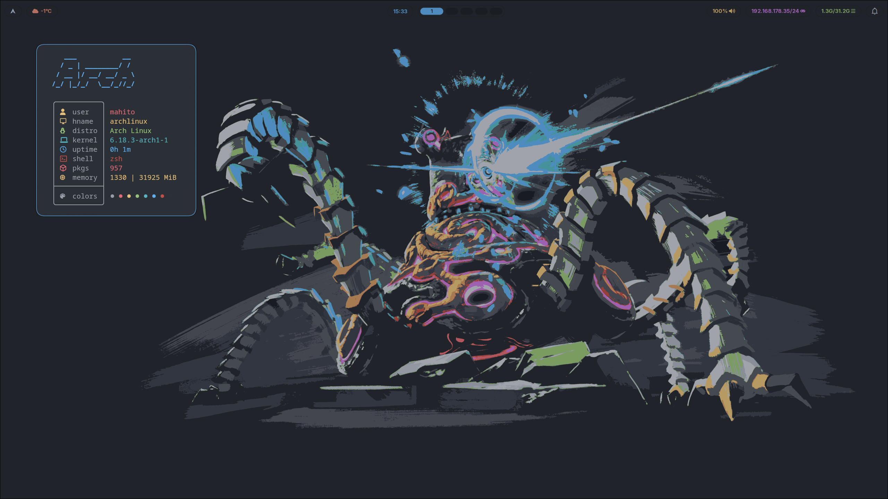

# Hyprland Configuration Files by Mahito

My Personal dotfiles. I used a fresh install of **Arch Linux** + **Hyprland** + **Waybar** + **SwayNC**.
My dotfiles are inspired by my first rice but my arch broke and I lost everything. The Rice is mainly based on the [Atom One Dark Theme](#theme) but I later added new themes and a theme switcher based on rofi.
It took me a few days to rice everything, but it really payed off at the end and i am proud of it.
I hope ya all are enjoing the rice/config :D

---

## Table of contents

- [Screenshots](#screenshots)
- [Dependencies](#dependencies)
- [Installation](#installation)
- [Theme](#theme)
- [Oh-My-ZSH installation](#oh-my-zsh-installation)

---

## Screenshots
<div align="center">
  
</div>

---

## Dependencies

Here is a full list of them all:

<table>
<tr>
<td valign="top">

## Hyprland & Terminal

- Hyprland
- Kitty
- Cava
- Unimatrix
- Thunar
- Fastfetch
- GTK-3.0
- GTK-4.0
- htop
- nwg-look
- qt5ct
- Rofi
- SwayNC
- Waybar
- xsettingsd
- ttf-jetbrains-mono-nerd
- Python3
- Git
- ZSH
- NeoVim/[LazyVim](http://www.lazyvim.org/installation)
- tty-clock
- Yazi
- asciiquarium
- sl
- Npm

</td>
<td valign="top">

## Nvidia Dependencies

- nvidia-open-dkms <br> **(For 50XX-Series only)**
- nvidia-dkms <br> **(For 40XX-Series and older)**
- nvidia-utils
- nvidia-settings
- linux-zen-headers

</td>
</table>

### Arch based distros:

```bash
yay -S hyprland kitty cava unimatrix thunar fastfetch gtk htop nwg-look qt5ct rofi swaync waybar xsettingsd ttf-jetbrains-mono-nerd python3 git zsh nvim tty-clock yazi asciiquarium-transparent-git sl npm
```

### Ubuntu based distros:

```bash
sudo apt install hyprland kitty cava unimatrix thunar fastfetch gtk htop nwg-look qt5ct rofi swaync waybar xsettingsd ttf-jetbrains-mono-nerd python3 git zsh nvim tty-clock yazi asciiquarium sl npm
```

### Fedora:

```bash
sudo dnf install hyprland kitty cava unimatrix thunar fastfetch gtk htop nwg-look qt5ct rofi swaync waybar xsettingsd ttf-jetbrains-mono-nerd python3 git zsh nvim tty-clock yazi asciiquarium sl npm
```

### Debian:

```bash
sudo dpkg install hyprland kitty cava unimatrix thunar fastfetch gtk htop nwg-look qt5ct rofi swaync waybar xsettingsd ttf-jetbrains-mono-nerd python3 git zsh nvim tty-clock yazi asciiquarium sl npm
```

---

## Installation

You just need to clone this repository with `git clone https://github.com/Mahito994/Arch-Hyprland-Dots.git`.

```bash
git clone https://github.com/Mahito994/Arch-Hyprland-Dots.git ~/.config
```

(Note: It can be that it is cloning a folder called "Arch-Hyprland-Dots" and in that case you need to manual needw to move them i folder back.)

---

## Theme

- [GTK-Theme](https://github.com/UnnatShaneshwar/AtomOneDarkTheme)
- [Kitty](https://github.com/dexpota/kitty-themes/blob/master/themes/OneDark.conf)

---

## Oh-My-ZSH installation

#### 1. Make sure that u have installed zsh and curl

For example on Arch based distros:

```
yay -S zsh curl
```

#### 2. Clone the Oh-My-ZSH script with curl

```
sh -c "$(curl -fsSL https://raw.githubusercontent.com/ohmyzsh/ohmyzsh/master/tools/install.sh)"
```

(Note: Make sure to select yes when they are asking "Do u want to set ur shell to zsh?")

#### 3. Install and set the theme to powerlevel10k/powerlevel10k

Set the theme in the `.zshrc` file to **powerlevel10k/powerlevel10k**. For example:

```
nano .zshrc
```

After that download the powerlevel10k repository with this script:

```
git clone --depth=1 https://github.com/romkatv/powerlevel10k.git "${ZSH_CUSTOM:-$HOME/.oh-my-zsh/custom}/themes/powerlevel10k"
```

After that restart your Terminal and a setup/configure script will start and u can cusomize it. U can always change/redo it with:

```
p10k configure
```

---
